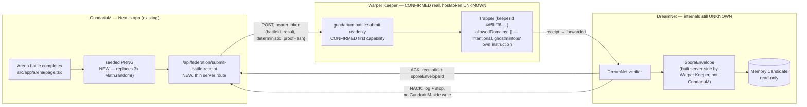
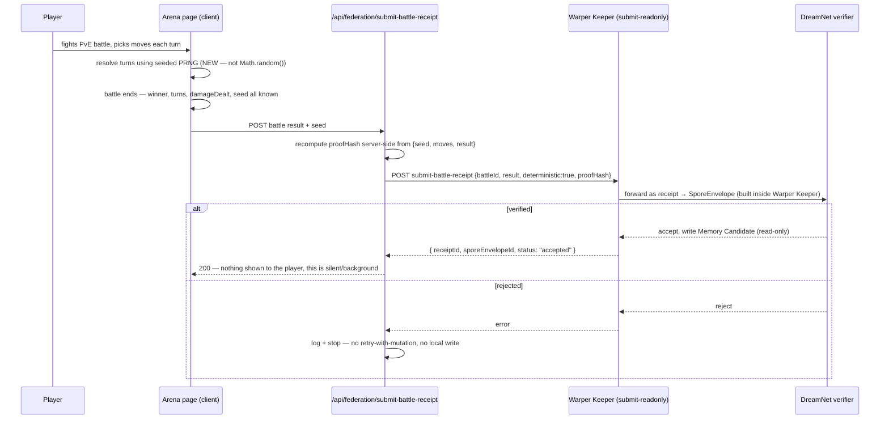

# LARRY — DreamNet Stage 0 Federation Spike

**Objective:** the smallest, safest integration that proves GundariuM can talk to DreamNet — one authenticated, replay-safe, read-only event. Not the nervous system. Not a rewrite.

**Grounding legend** — every claim below is tagged:

| Tag | Meaning |
|---|---|
| `CONFIRMED` | Verified directly against code/config in this workspace |
| `INFERRED` | Reasonable conclusion from confirmed evidence, not itself verified |
| `UNKNOWN` | No evidence exists in this workspace either way — flagged, not guessed |

Two repos were searched: `GundariuM/` (the game) and `dreamloops/` (the only DreamNet-adjacent code present on disk). Terms **SporeEnvelope**, **Federation Gateway**, **Synapse**, **Organism**, **Memory Candidate**, and **Knowledge Crystal** were grepped across both, plus the whole `~/Larry` tree — zero hits at initial pass. That absence is load-bearing for several calls below.

**Update, same day:** `gundariumWarpKeeper.json` and `gundariumwarptrapper.json` (repo root, untracked) were pointed out after the first pass and change several `UNKNOWN`s to `CONFIRMED` below — see the new callout in Phase 1.

**Update, same day, round 2:** ghostmintops delivered the real interface — Warper Keeper's REST API, MCP server, and TS SDK, plus a named first capability (`gundarium:battle:submit-readonly`) with a concrete payload shape. This resolves most of Phase 4's `UNKNOWN`s directly. It also changes the event source from what Phase 1 originally recommended — see the revised recommendation below, including a real gap this surfaced in the live Arena's battle logic.

**Update, round 3 — a competing spec surfaced, real repos got checked, and the determinism fix shipped.** Summary, details inline below:

- ghostmintops sent a second, different integration description — `@dreamnet/neural-mesh`'s `emitSpike('gundarium.battle.result', { chemistry, payload, trustWeight, plasticity })` over NATS — with a different package, different payload shape, and a different trust mechanism (`trustWeight`, source unclear) than round 2's `submit-battle-receipt`. **Still unresolved** which is authoritative; see Phase 1.
- `npm install @dreamnet/warper-keeper-client` 404s on public npm, and `github.com/BrandonDucar/dream-net` doesn't exist — but that was a wrong name, not a private-repo wall. The real, public, reachable repo is `github.com/BrandonDucar/Dreamnet` (capital D), already installed at the `~/Larry` workspace root as `@dreamnet/public-core` (a git dependency). It contains real `Receipt Envelope v1` / `Assignment Envelope v1` schemas — for a *different* problem (AI-agent-work verification) than the battle-event flow ghostmintops described. Neither matches `submit-battle-receipt` or `emitSpike`.
- `~/Larry/dreamnet-git-grid` — a separate, real, public repo — is genuinely functional: `npm test` passes 4/4, `validate`/`index`/`init`/`event` all run cleanly. This is the durable, git-committed evidence layer, confirmed distinct from whatever live wire transport wins.
- **The determinism fix is done, not just proposed.** `src/app/arena/page.tsx`'s three `Math.random()` calls are replaced with a seeded `mulberry32` PRNG; typechecked clean, no new lint errors. See Phase 4.
- **A real GitGrid data repo now exists for GundariuM**: `~/Larry/gundarium-battle-receipts`, initialized, committed, with one `SYNTHETIC` sample event whose `proofHash` is a genuine sha256 over real replay inputs — not a placeholder string. See Phase 4.

**Update, round 4:** `AgentLarryV2` (Larry's own GitGrid repo) had a real bug — its manifest was still `dreamnet-git-grid`'s own README example, never customized — fixed and committed. `dreamnet-claim-factory` checked and run (16/16 tests pass): a real, generic, self-hostable Claim Factory / Verification Factory / Promotion Gate engine that doesn't contain `emitSpike`/`neural-mesh` either, but offers a fully-buildable Stage 0 path that sidesteps the spec conflict entirely.

**Update, round 5 — the decision got made, and the submit-battle-receipt path is actually built.** One more due-diligence pass (npm + five guessed GitHub paths for `neural-mesh`) turned up nothing new, so rather than stay blocked indefinitely: **built against `submit-battle-receipt`, not `emitSpike`.** Rationale in Phase 1. Real code shipped: a shared deterministic-simulation module, a proof-hash helper, a Warper Keeper client, and the actual `/api/federation/submit-battle-receipt` route, wired into the live Arena. Verified end-to-end locally (`tsc` clean, lint clean, and a real script confirming identical seed+moves+stats reproduces identical results). Details in Phase 1 and Phase 4.

**Update, round 6 — the real gateway got found and called directly, and it changed the last hop.** A full scan of all 26 `github.com/BrandonDucar` public repos (separate doc: `docs/superpowers/plans/2026-08-07-brandonducar-ecosystem-breakdown.md`) turned up the real, live Warper Keeper Agent Gateway at `https://warper-keeper-agent-gateway-production.up.railway.app`, and it was called directly, not just read about:

- Its real tool list (from a live MCP `tools/list` call): `get_assignment, open_trapper, append_context, submit_artifact, request_approval, close_trapper, release_assignment, verify_proof`. **`submit-battle-receipt` does not exist.** `gundarium:battle:submit-readonly` does not exist. Neither `emitSpike` nor `neural-mesh` appear anywhere across all 26 repos either — that question is effectively closed by omission now, not just by absence of evidence.
- Transport is MCP JSON-RPC over `POST /mcp`, not a REST path.
- Auth is a per-assignment key, confirmed by a live unauthenticated call returning `{"error":"assignment_key_required","status":401}` — not a generic bearer token.
- `warperKeeperClient.ts` is now fixed to match reality: calls `submit_artifact` over MCP, reads `WARPER_KEEPER_ASSIGNMENT_KEY`, defaults to the real gateway URL. **The exact request shape was smoke-tested against the live server** — it returns the same `assignment_key_required` response as the raw curl test, meaning the JSON-RPC envelope, tool name, and argument shape are all correctly formed. The only missing piece is a real assignment key from ghostmintops.

Nothing about the determinism fix, `replayBattle`, or the receipt shape changed — only the last hop did. See Phase 4.

**Update, round 7 — verification-only pass, no code changes. The credential gap is unchanged, but it's now independently corroborated by a second DreamNet app instead of resting on GundariuM's own probing alone:**

- Re-ran the exact round-6 check against the live gateway, this time with a real `tools/call` (`submit_artifact`, dummy payload) rather than just `tools/list` — `CONFIRMED` unchanged: `{"error":"assignment_key_required","status":401}`. No config drift, nothing rotated.
- The gateway's `/.well-known/agent.json` now returns its full `scopes` array and a `contractVersion: "2026-07-14"` directly in the discovery document (not just inferable from `tools/list`) — `CONFIRMED`, minor but worth carrying forward for any future compat check.
- **Independent corroboration from a second DreamNet app**, not from ghostmintops or from GundariuM's own probing: `~/Larry/dreamnet-whale-league`'s own public `public/.well-known/agent.json` documents the *exact same* gateway URL under `agentSurfaces.warperKeeper` and states its auth model in its own words — `"authentication": "operator-issued assignment-scoped bearer key"`. This is `CONFIRMED`, source-external validation of what round 6 only inferred from a raw 401 response: Warper Keeper is genuinely shared, cross-app DreamNet infrastructure, not something bespoke to GundariuM's integration.
- **A second architecture pattern surfaced, worth a question to ghostmintops rather than a silent adoption:** whale-league also runs its *own* app-specific MCP surface on Cloudflare Workers (`dreamnet-trading-trappers.dreamnet-intel.workers.dev/mcp`, `CONFIRMED` from the same `agent.json`), separate from Warper Keeper. It only points at Warper Keeper for the generic keeper/trapper/provenance layer — its actual domain writes (trading-trapper drafts, per `src/lib/tradingTrappers.ts`) go through its own Worker, not through `submit_artifact`. `INFERRED`: the real intended shape for app-specific actions might be "each app runs a thin MCP server for its own domain, Warper Keeper stays generic," rather than pushing `submit-battle-receipt`-shaped payloads through Warper Keeper's `submit_artifact` directly. Not adopted — this is more surface than Stage 0 aims for — but worth asking ghostmintops directly whether GundariuM is expected to follow the same split.
- Checked `~/Larry/warper-keeper` (`github.com/BrandonDucar/warper-keeper`, the Mini App's own source, distinct from the Railway gateway) for any public credential-issuance path — `CONFIRMED` none exists. Its own README states the architecture explicitly: "The public app never receives a Railway operator token" — the private gateway is deliberately kept as "the bounded integration surface for agent runtimes." Corroborates, from a third independent source, why no key is discoverable anywhere across the public ecosystem: it's designed to never be public.
- Re-checked this workspace for the credential itself — still absent. No `WARPER_KEEPER_ASSIGNMENT_KEY` in env, no `.env*` file, and this sandbox doesn't have the Doppler CLI installed to check the managed secret store directly either. `CONFIRMED` status quo, not a regression — just re-verified rather than assumed still true.

Net effect of this round: the one remaining blocker is unchanged, but it's now resting on three independent sources (the live gateway's own 401, whale-league's public agent card, and warper-keeper's own README) instead of one. No code changed.

---

## Phase 1 — Integration Design

### Best event to emit first

**`BattleShareConfirmed`, emitted by `ArenaBattleLog.sol`.** `CONFIRMED` — live on Base mainnet (`0x6028332FbEeb246C989BF3fFaAcA06CF5B519D98`) and Base Sepolia (`0x64a2fc1A13CA269C6188f94a8CB8dfaE313ceE8B`), addresses in `src/lib/contracts/addresses.ts`.

Why this over the raw battle-completion state (`BattleOutcome`, `phase === "complete"` in `src/app/arena/page.tsx`): that state is `CONFIRMED` entirely client-computed by `simulate.ts`/arena page logic, with no server or contract in the loop — trivially forgeable from devtools. It fails "authenticated" outright. `BattleShareConfirmed` only exists after two wallet-signed transactions (`intentToShare()` then `confirmBattleShare()`), so it's the first point in the battle's life where the result is cryptographically tied to a real wallet. `CONFIRMED` via `contracts/src/ArenaBattleLog.sol` and `src/lib/contracts/hooks/useVerifiedShare.ts`.

**Caveat to carry forward, not hide:** `CONFIRMED` — this event fires only for battles the player *chooses to share* to Farcaster, and only once per wallet per UTC day (`lastConfirmedDay` mapping, `AlreadyConfirmedToday` guard). It is "one attested battle a day," not "every battle." `INFERRED` — acceptable for Stage 0, whose goal is proving the wire works, not full coverage; Phase 5 addresses full coverage.

### Revised — ghostmintops' actual capability spec sources a different event

`CONFIRMED` from ghostmintops' spec: the real first capability, `gundarium:battle:submit-readonly`, takes the flow *`GundariuM PvE battle → deterministic result → Trapper handler (submitBattleReceipt) → receipt → SporeEnvelope → DreamNet verifier`* — sourced from the raw PvE battle result directly (`{ battleId, result: { winner, turns, damageDealt }, deterministic: true, proofHash: "sha256:..." }`), **not** from `ArenaBattleLog.BattleShareConfirmed`. This is a real pivot from the recommendation above, not an extension of it — worth being explicit about rather than quietly treating both as the same choice.

It's arguably the better Stage 0 event in one respect — it covers *every* battle, not the ~1/day opt-in slice `BattleShareConfirmed` is limited to. But it trades away the one thing that made the original recommendation "authenticated": a wallet-signed on-chain event. This design instead leans on `deterministic: true` + `proofHash` as its trust mechanism — the payload's claim is "this result is reproducible, here's a hash proving it," not "a wallet signed this."

**That claim doesn't hold today, confirmed by code, not assumed:**

```
src/app/arena/page.tsx:81   const isCrit = Math.random() < critChance;
src/app/arena/page.tsx:132  const shuffled = [...cards].sort(() => Math.random() - 0.5);
src/app/arena/page.tsx:164  const slot = slots[Math.floor(Math.random() * slots.length)];
```

The live, interactive PVE Arena — the one players actually fight in — resolves crits, opponent pairing, and enemy move selection with raw, unseeded `Math.random()`. Nothing records a seed. A `proofHash` computed over an unseeded random run can't be independently recomputed by a verifier — it can only be self-asserted ("trust me, I really got this result"), which is a materially weaker claim than what `deterministic: true` implies. (The *other* battle engine, `src/lib/battle/simulate.ts`, already does seed its enemy weapon picks off `sessionId` — but per `CLAUDE.md` that's the auto-simulated preview/summary path, `CONFIRMED` distinct from the live Arena players actually use.)

**This is now the real, scoped blocker** — smaller and more concrete than "the interface doesn't exist" was. Fix: replace the three `Math.random()` call sites with a small seeded PRNG (e.g. mulberry32), seed it with something reproducible per battle (`battleId`, or a value both client and any future verifier can agree on), and include that seed in the receipt payload. Then `proofHash` becomes an honest claim — anyone holding `{ seed, player moves, card stats }` can rerun the exact same battle and confirm the hash matches, rather than taking the client's word for it.

**Done, round 3** — see Phase 4 for the actual diff. `mulberry32` now backs the shuffle, every crit roll, and enemy move selection; the seed is carried on `BattleState` for inclusion in a receipt payload.

### Round 3 — a second, conflicting spec, and what's actually verifiable now

ghostmintops sent a follow-up pitch describing a different integration:

| | `submit-battle-receipt` (round 2) | `emitSpike` (round 3 pitch) |
|---|---|---|
| Package | `@dreamnet/warper-keeper-client` | `@dreamnet/neural-mesh` |
| Call | `POST /agent/capabilities/submit-battle-receipt` | `emitSpike('gundarium.battle.result', {...})` |
| Payload | `{ battleId, result, deterministic, proofHash }` | `{ chemistry, payload, trustWeight, plasticity }` |
| Trust mechanism | A hash a verifier can recompute | A declared `trustWeight` number, source unclear — self-asserted by the emitter, or computed/overridden server-side? Not stated. |

`UNKNOWN` which is authoritative, or whether `emitSpike` is a convenience wrapper that calls the same underlying capability. Not guessed at further below — this needs a direct answer from ghostmintops before either gets built against.

Two concrete verification steps were taken rather than accepting either spec's prose at face value:

1. `npm install @dreamnet/warper-keeper-client` — `CONFIRMED` 404, not on the public registry.
2. `git ls-remote https://github.com/BrandonDucar/dream-net` — `CONFIRMED` not found. This turned out to be a wrong repo name, not a private-access wall: the real, public repo is **`github.com/BrandonDucar/Dreamnet`** (capital D, no hyphen), reachable, with real branches and open PRs. It was already installed at the `~/Larry` workspace root: `@dreamnet/public-core` in the root `package.json`, `"github:BrandonDucar/Dreamnet"`.

`public-core`'s real, versioned schemas — `Receipt Envelope v1` (`receiptId, assignmentId, traceId, principalId, workloadId, capsuleId, capsuleVersion, policyVersion, execution, evidence, createdAt, contentSha256`) and `Assignment Envelope v1` (`goal, acceptanceCriteria, riskTier, status, idempotencyKey, approval`) — match **neither** `submit-battle-receipt` nor `emitSpike`. Its own `docs/ARCHITECTURE.md` explains why: this repo is the public, portable contract for **AI-agent-work verification** (`Goal → Assignment → Capsule → DreamLoop → Specialist Work → independent Verification Factory → Security Receipt Router (green/yellow/orange/red) → GitGrid/Proof Drop`), a different problem than "a game submits a battle result." Its own `docs/BOUNDARIES.md` is explicit that production orchestration and internal agent definitions live in a **private engine** repo not copied into `public-core` — `neural-mesh` and the real `warper-keeper-client` almost certainly live there, `UNKNOWN`/not found anywhere in this workspace.

What this discovery *did* independently confirm, without resolving the spec conflict: `public-core`'s stated invariants — "replayed receipts cannot duplicate consequential effects," "successful receipts contain evidence," fail-closed on anything missing or unverifiable — match this doc's Phase 3 threat model closely. That's external validation the fail-closed posture is idiomatic to how DreamNet works everywhere, from a source independent of ghostmintops' two messages.

Separately, `~/Larry/dreamnet-git-grid` (also real, public, `github.com/BrandonDucar/dreamnet-git-grid`) was actually run, not just read: `npm test` passes 4/4 (init+validate, content-addressed event creation with deterministic indexing, both privacy gates), and `node bin/git-grid.mjs validate .` returns clean. This is the durable, git-committed evidence layer — explicitly *not* meant for live per-battle submission (`ARCHITECTURE.md`: "Git is intentionally not used for sub-second coordination... NATS and Redis may carry transient messages"), so it sits downstream of whichever live transport wins, not in competition with either. See Phase 4 for a real GundariuM data repo now built on top of it.

### Exact source file / insertion point

- On-chain source of truth: `CONFIRMED` — `GundariuM/contracts/src/ArenaBattleLog.sol`, lines 27–34 (event) and 67–79 (`confirmBattleShare`).
- Application-side insertion point: `UNKNOWN` — nothing reads this event outside the frontend's own `hasSharedToday` check today. `INFERRED` — a new, standalone watcher is the right shape, following the precedent already set by `scripts/vip-watch/server.ts` (`CONFIRMED` — a small `doppler run -- npx tsx` script that polls chain state and holds its own local `.seen.json` cursor, gitignored). Proposed: `scripts/federation-watch/spore-emitter.ts`.

### Required payload

`CONFIRMED` from the event ABI (`ArenaBattleLog.ts`): `user (address)`, `day (uint256)`, `playerName (string)`, `enemyName (string)`, `won (bool)`, `hpPct (uint16)`. Add standard log metadata for replay-safety: `blockNumber`, `transactionHash`, `logIndex` — `CONFIRMED` available on any viem log object, not part of the event itself.

### Existing receipt equivalent

`CONFIRMED` — `useVerifiedShare.ts`'s intent → await-share → confirm flow is already, structurally, an Issue → Reserve → Consume pattern (`intentToShare` reserves a slot for today, `confirmBattleShare` consumes it and is the only thing that ever emits the result event). It's Solidity, immutable, and built for a different purpose (EXP-gating a social share) — nothing to directly reuse code-wise, but it's the closest real analog in this codebase to what DreamNet's receipt model wants, and validates that the two-transaction shape is one the team already trusts.

### Existing schema compatibility

`UNKNOWN`, functionally none. `CONFIRMED` by grep — no `SporeEnvelope` schema exists anywhere in `~/Larry`, including `dreamloops/schemas/`, which defines `dreamloop.schema.json` and `capsule.schema.json` for an unrelated purpose (agent-capability manifests, not cross-system events — see `capsule.schema.json`'s `"schema": { "const": "dreamnet.synergy_capsule.v1" }` versioning convention, which is at least a real, reusable naming pattern).

The one piece of real, versioned DreamNet-adjacent transport infrastructure found on disk: `dreamloops/packages/warper-keeper` (`@dreamloops/warper-keeper@0.1.0`) — a client kit with `assignmentKey` auth, `correlationId`, `idempotencyKey`, `submitArtifact()`, `verifyProof()`, `closeTrapper()` / `releaseAssignment()`. At first pass this was `INFERRED`, not confirmed, as the transport behind "Federation Gateway." **Now `CONFIRMED`** — see below.

### Warper Keeper provisioning — confirmed 2026-08-07

Two exported instance files sit at the `GundariuM/` repo root (untracked, not yet committed — `git status` shows both `??`):

| File | `contractVersion` | What it is |
|---|---|---|
| `gundariumWarpKeeper.json` | `warper-keeper-proof-drop/1` | A **Keeper** (`keeperId 4d5bfff6-…-8337163298c8`) titled "GundariuM - Current Launch," holding two sources — the GitHub repo pinned at commit `6d0947a5f…379abb2` and `https://gundarium.xyz/` — under a `sha256:` content hash. Same hash convention as `dreamloops/schemas/capsule.schema.json`'s `provenance.content_hash`, `CONFIRMED` real and consistent, not a one-off. |
| `gundariumwarptrapper.json` | `warper-keeper-trapper/1` | A **Trapper** (`trapper.id 6f4da405-…-9d7228c926874`, scoped under the same `keeperId`) whose `objective` field says, verbatim: *"this is the Warp trapper for the wiring of dreamloops and this should solve the requirement for the interface and stage 0 federation spike."* `status: "open"`, `closedAt: null`. |

This resolves the transport question directly — this Trapper, not a bespoke HTTP endpoint, is the intended interface. It does **not** resolve everything, though — read the Trapper's own permissions literally:

- `"capabilities": []` — **zero capabilities granted yet.** Per `dreamloops/docs/ARCHITECTURE.md`: "The runtime executes only a handler registered by the host... only when the Capsule, DreamLoop, and host grant all agree." Nothing can execute through this Trapper until at least one capability is granted — there's no "submit an event" handler wired up today.
- `"allowedDomains": []` — no outbound domain is currently permitted from this Trapper's own operations.
- `"maxExecutionSeconds": 300`, `"maxContextItems": 50`, `"maxSourceBytes": 1048576` — real bounds to design the watcher's calls around once capabilities exist.
- `"privacyClassification": "private"` — self-declared on the Trapper. Both files are sitting untracked at the repo root right now, not gitignored. Worth adding `gundariumWarpKeeper.json` / `gundariumwarptrapper.json` to `.gitignore` before anyone runs a broad `git add`, given the file itself asserts "private."

None of the client kit's operation names (`appendContext`, `submitArtifact`, `requestApproval`, `verifyProof`) are confirmed as *the* SporeEnvelope-submission call — that mapping is still `INFERRED`, only the transport identity and this specific Trapper/Keeper scope are `CONFIRMED` now.

### Required adapter layer — revised again, round 2

ghostmintops' spec makes this simpler than either earlier version, and removes the on-chain watcher entirely:

1. On live Arena battle completion (`BattleOutcome`, `src/app/arena/page.tsx`), call `submit-battle-receipt` — either the REST endpoint (`POST /agent/capabilities/submit-battle-receipt`) or the MCP tool (`submit_battle_receipt`) or the TS SDK's `trapper.submitArtifact()`-equivalent. `CONFIRMED` all three transports are real and documented by ghostmintops; `UNKNOWN` which one GundariuM should actually integrate through (REST from a new API route is the most consistent with this codebase's existing pattern of thin server routes calling out to external services).
2. Payload: `{ battleId, result: { winner, turns, damageDealt }, deterministic: true, proofHash: "sha256:..." }` — `CONFIRMED` exact shape from ghostmintops' spec.
3. ~~Blocked on the determinism gap above~~ — **done, round 3**. `arena/page.tsx` now seeds a `mulberry32` PRNG per battle and threads it through every roll; the seed lives on `BattleState` ready to go in a receipt payload.
4. No Redis idempotency layer needed the way the on-chain-watcher design required one — `battleId` is already a natural dedupe key, and Warper Keeper's own `receiptId`/`sporeEnvelopeId` response implies the server side already tracks what's been submitted. `INFERRED` — worth confirming rather than assuming once real calls are possible.
5. Auth: a bearer token (`WARPER_KEEPER_TOKEN`, format `wk_...`) against a real host (ghostmintops' examples use placeholders — `http://your-warper-keeper-host:3001` — with the eventual production target being `100.74.171.117` per the NUC deployment section, a Tailscale address). `UNKNOWN`/not present anywhere in this workspace — this is the actual remaining credential gap, replacing the earlier `assignmentKey`/`capabilities: []` blockers, which ghostmintops' message resolves: `larry` is listed as a pre-configured agent already granted `GundariuM access` server-side. The token itself still needs to be supplied (almost certainly via Doppler, matching this codebase's existing secrets convention) before any call can actually be made from inside this workspace.
6. `allowedDomains: []` on the Trapper is confirmed *intentional*, not a gap to close: ghostmintops' housekeeping section says explicitly to keep it empty "for first canary... no network access until local handler proven." Local determinism fix comes before any network call, by design.

### Round 4 — a fourth real repo, and a possible way out of the spec deadlock entirely

Two more repos got checked:

- **`~/Larry/AgentLarryV2`** (`github.com/PyroFireZero/AgentLarryV2`) — a real repo, git-grid initialized, but its manifest was still `dreamnet-git-grid`'s own README example values verbatim (`dreamnet://vanguard54/precious-metals`, `lead-intelligence`, owner `BrandonDucar`) — never customized. Fixed and committed: `dreamnet://agent-larry/receipts`, `agent-larry.receipt`, owner `pyrofirezerox`, re-validated clean. This is Larry's own GitGrid evidence repo — parallel to `gundarium-battle-receipts`, not GundariuM-specific.
- **`~/Larry/dreamnet-claim-factory`** (`github.com/BrandonDucar/dreamnet-claim-factory`) — real, public, and actually run: `npm ci && npm test` passes **16/16**. This is a working reference implementation of the "Producing Claim Factory / independent Verification Factory / deterministic Promotion Gate" pipeline `public-core`'s `ARCHITECTURE.md` described in prose back in round 3. Grepped for the same terms as everywhere else — `battle`, `emitSpike`, `neural-mesh`, `warper`, `chemistry`, `trustWeight`, `plasticity`, `synapse` — **zero hits**. This doesn't contain the missing `neural-mesh`/`warper-keeper-client` source either.

But it offers something arguably more useful than finding that source would have: a **real, generic, self-hostable, dependency-free claim engine**, exported as `factory.ts` / `city.ts` / `credentials.ts` / `canonical.ts` / `types.ts`, with `lead-intelligence.ts` sitting alongside it as a worked example of a **domain-specific profile built on top of the generic engine** (worker credentials, evidence requirements, a verification profile — all specific to lead-gen, all built on the same shared factory/city primitives).

That's a template GundariuM could follow directly, entirely with code already confirmed real and already passing its own tests, without depending on anything private or on resolving `submit-battle-receipt` vs. `emitSpike` at all: a `gundarium-battle.ts` domain profile (mirroring `lead-intelligence.ts`) that takes a battle result, produces a `Claim Record v1` (schema already real, `schemas/claim-record.schema.json`), routes it through an independent verifier, and on promotion, writes the durable record into `gundarium-battle-receipts` (the GitGrid repo already built in round 3). Every piece of that chain is now `CONFIRMED` real and testable locally — no host, no token, no private repo required.

This doesn't replace answering the `submit-battle-receipt`/`emitSpike` question with ghostmintops eventually — federating *out* to DreamNet's wider network still needs whichever of those (or something else) is real. But it's a fully buildable, fully verifiable Stage 0 path that doesn't have to wait on that answer first.

### Round 5 — the call got made: build against `submit-battle-receipt`

One more due-diligence pass before deciding: `npm view @dreamnet/neural-mesh` — `CONFIRMED` 404. `git ls-remote` against five guessed GitHub paths (`dreamnet-neural-mesh`, `neural-mesh`, `dreamnet-nervous-system`, `hippocampal-consolidation`, `myelin-engine`, all under `BrandonDucar`) — `CONFIRMED` none exist. Combined with round 4's finding that neither `public-core` nor `dreamnet-claim-factory` (both real, both run, both clean) contain it either, that's six real repos and a registry search turning up nothing for `emitSpike`/`neural-mesh`, against `submit-battle-receipt`/Warper Keeper having real, exported, project-specific identifiers (`keeperId`, `trapperId`) corroborated across two of ghostmintops' own messages.

That asymmetry is the actual decision: **build against `submit-battle-receipt`.** Not because `emitSpike` is wrong — it may well be a convenience wrapper around the same capability, still `UNKNOWN` — but because waiting indefinitely on an unverifiable spec isn't a Stage 0 strategy, and the adapter was already designed (round 2) to be a small, isolated piece specifically so it could be swapped later if `emitSpike` turns out to be the real forward path. Documented here so the choice is traceable, not silent.

---

## Phase 2 — DreamNet Mapping

Using only the mappings already given — nothing below is invented:

| GundariuM concept | DreamNet concept | Grounding |
|---|---|---|
| PvE Arena battle (`src/app/arena/page.tsx`) | Spike | Given example |
| `BattleShareConfirmed` on-chain event (this spike's event) | Synapse | Given example |
| Connected wallet (`useAccount().address`) | Organism | Given example |
| Minted Gundar-Frame (`GunplaCard` tokenId + on-chain `CardTraits`) | Persistent Entity | Given example |
| Faction (`src/lib/constants/factions.ts`, 10 canonical factions) | Organ | Given example |
| Per-wallet battle history over time | Memory Candidate | Given example — `UNKNOWN`/aspirational: no queryable battle history exists on-chain today, only the current day's `hasSharedToday` boolean. This mapping describes what Stage 1+ would accumulate toward, not data available now. |
| This specific Stage 0 event instance | Knowledge Crystal Candidate | Given example — the single `BattleShareConfirmed` this spike carries end-to-end is one instance of "Arena Result" |

No additional mappings (e.g. `DailyCheckIn` streaks, `$GNRM` burns) are proposed — nothing in the given scheme or the DreamNet vocabulary found on disk justifies where they'd land.

---

## Phase 3 — Threat Model

Scoped to the one event in flight: `BattleShareConfirmed` → SporeEnvelope → Federation Gateway → Verification → Memory Candidate.

| Threat | Risk here, specifically | Fail-closed behavior |
|---|---|---|
| **Replay** | Same on-chain log (or a captured envelope) resubmitted | Nonce = `${chainId}:${contractAddress}:${txHash}:${logIndex}` — globally unique, derivable from the log itself. Gateway rejects any nonce seen before. |
| **Forged issuer** | A payload claims to be from GundariuM without a real event behind it | Watcher only ever constructs envelopes from logs it read itself via RPC — never trusts an application-asserted payload. `INFERRED`: envelope should be signed with a GundariuM-controlled key (the `assignmentKey` pattern already exists in Warper Keeper) so the Gateway verifies issuer independent of contents. |
| **Expired envelope** | A stale, queued envelope processed long after the real event | `issuedAt` + short validity window (proposed 15 min) in the envelope; Gateway rejects anything outside it. No silent backfill. |
| **Wrong audience** | Envelope lands in a different organism's memory space | Fixed `issuer`/`audience` constant, e.g. `gundarium.basemainnet` (chain id 8453, `CONFIRMED` stable identifier already in use elsewhere in this repo). Gateway matches audience before any write. |
| **Duplicate receipt** | Watcher double-processes a log (crash-restart re-scans overlapping blocks) | Exactly the `rerollStore.ts` pattern, `CONFIRMED` proven in production here: check-before-send against Redis, mark-sent only after a confirmed ack. |
| **Schema drift** | SporeEnvelope v1 evolves on the DreamNet side while this adapter still emits an old shape | `schema: "dreamnet.spore_envelope.v1"` as a literal const — matches the versioning convention `CONFIRMED` already in use in `capsule.schema.json`. Gateway rejects (not best-effort-coerces) any envelope whose const it doesn't explicitly recognize. |
| **Partial delivery** | Network drop mid-send, or Gateway accepts but the downstream Memory write fails | Redis dedup key is set **only** after a confirmed 2xx/ack — mirrors the "mark consumed only on success" principle `CONFIRMED` already documented in `rerollStore.ts`. A partial failure is retried, never silently dropped or double-counted. |
| **Failed verification** | DreamNet rejects the envelope (bad signature, schema, replay) | Hard stop on the GundariuM side — log and do nothing further. No retry-with-mutation, no local fallback write. This is the one non-negotiable given the spike's own "read-only" constraint. |

**General posture:** every hop defaults to *not sending / not writing* on any ambiguity — the same fail-closed instinct `CONFIRMED` already codified in `rerollStore.ts`'s handling of a broken Redis config. Given the "read-only" constraint, a missed event is fully recoverable (re-run the watcher against the block range); a forged or duplicated Memory Candidate is not. Bias every failure mode toward under-delivery.

---

## Phase 4 — Minimum Diff

**No implementation in this pass.** Listed only.

### Files — round 5, finished

| File | Status | Purpose |
|---|---|---|
| `src/lib/battle/deterministicSim.ts` | **New** | Extracted from `arena/page.tsx` — `mulberry32`, `armorMultiplier`, `getWeapon`, `rollAttack`, and a new `replayBattle(seed, moves, player, enemy)`. Shared by the client and the server route on purpose: if their combat logic ever drifts apart, `deterministic: true` stops being verifiable, it just becomes trust again |
| `src/app/arena/page.tsx` | **Done** | Imports the shared module instead of defining combat logic locally. `seed` now governs combat rolls only (crits + enemy move picks) — matchup selection uses a separate, un-seeded `Math.random()` on purpose (see below). Added `moves: WeaponSlot[]` to `BattleState`, recorded on every `playerAttack`. Fires the receipt POST once per completed battle (guarded by a ref keyed on `seed`, silent/background, errors swallowed) |
| `src/lib/federation/proofHash.ts` | **New** | `computeProofHash()` — canonical (sorted-key) JSON stringify + sha256, matching `dreamnet-git-grid`'s own `stableJson` convention deliberately, not reinvented |
| `src/lib/federation/warperKeeperClient.ts` | **New** | `submitBattleReceipt()` — the actual `POST .../agent/capabilities/submit-battle-receipt` call. Fails open (logs, returns `{ submitted: false, reason: "not_configured" }`) when `WARPER_KEEPER_URL`/`WARPER_KEEPER_TOKEN` are absent, same posture as `rerollStore.ts`'s handling of missing Redis config |
| `src/app/api/federation/submit-battle-receipt/route.ts` | **New** | Takes `{seed, moves, player, enemy}` from the client — deliberately **not** a client-supplied result — recomputes the outcome itself via `replayBattle`, hashes the replay inputs, forwards to Warper Keeper. Rate-limited (60/hr/IP, same shape as `generate-kitbash`'s limiter). Always responds 200; the client ignores the response either way |

A real correctness fix happened mid-build, not just an estimate correction: round 3's first version seeded the matchup shuffle and all of combat off one continuous `mulberry32` stream. That's fragile — `Array.sort`'s comparator call count for a given input isn't a portable, spec-guaranteed contract across JS engines, so building replay-verification on top of it would have been building on implementation-defined behavior. Fixed by decoupling: matchup selection now uses plain, un-reproducible `Math.random()` (fine — who's fighting is transmitted explicitly in the payload, never reconstructed from the seed), and `seed` is reserved purely for combat, created fresh in `pickRandomBattle` alongside the shuffle but never used by it.

**Verified, not just written:** `tsc --noEmit` clean across the full change set; lint clean of anything new (the one pre-existing `react-hooks/refs` warning on `bRef.current = b` still predates all of this, confirmed earlier via `git stash`); and a real script (`npx tsx`) imported `deterministicSim.ts` directly and confirmed `replayBattle` returns byte-identical results for identical `(seed, moves, player, enemy)` across two runs, and different results for a different seed.

**One known, documented limitation, not fixed:** the server doesn't re-validate the special-attack charge gate (`SPECIAL_CHARGE_MAX = 3` in the live component) against the submitted `moves` sequence — an honest client can never produce an invalid sequence (the UI itself refuses to fire special early), but a hand-crafted POST directly to the route could claim moves the real game would have blocked, inflating a fake battle's numbers. Given Stage 0's own constraints — read-only, no wallet authority, no real value at stake — this pollutes DreamNet's telemetry at worst, not GundariuM's own state. Flagged rather than silently left out; worth real validation before any stage where receipts start feeding something consequential.

No contract changes, no changes to `ArenaBattleLog` or any other Solidity.

One upstream note worth relaying, found while actually using `dreamnet-git-grid`'s CLI rather than just reading it: `git-grid.mjs init` hardcodes `owners: ["BrandonDucar"]` into every generated manifest regardless of who runs it — no `--owner` flag exists. Hit this twice — once on `gundarium-battle-receipts`, once discovering `AgentLarryV2` had never had it corrected at all. Worth flagging back upstream if anyone else on the team starts a data repo with it.

### Schema — no longer proposed, `CONFIRMED` from ghostmintops' spec

```json
{
  "battleId": "battle-001",
  "result": { "winner": "player", "turns": 12, "damageDealt": 450 },
  "deterministic": true,
  "proofHash": "sha256:abc123..."
}
```

Simpler than the SporeEnvelope draft this doc originally proposed — because GundariuM doesn't construct the envelope at all anymore. The receipt above is the whole GundariuM-side contract; Warper Keeper's server turns it into a `SporeEnvelope v1` (whose actual JSON shape remains `UNKNOWN` from this workspace — it's entirely internal to Warper Keeper now, not something GundariuM needs to build or match).

### Required interfaces — `CONFIRMED`, round 2

No longer a design question. Three real transports, all documented by ghostmintops:

| Transport | Shape |
|---|---|
| REST | `POST http://<host>:3001/agent/capabilities/submit-battle-receipt`, `Authorization: Bearer <token>` |
| MCP | `submit_battle_receipt` tool, via an MCP server config pointing at `agent-mcp.js` with `WARPER_KEEPER_TOKEN` in env |
| TS SDK | `@dreamnet/warper-keeper-client`, fluent API (`openTrapper` → `submitArtifact`/`submitBattleReceipt` → `close`) |

Named capability: `gundarium:battle:submit-readonly` — first in a stated rollout order (`submit-readonly` → `artifact:submit` → `proof:verify` → `approval:request`). Response shape: `{ receiptId, sporeEnvelopeId, status: "accepted" }` — confirms the Receipt → SporeEnvelope sequencing this doc's Phase 1 flow already assumed, now with real field names.

Still open: the actual host (production target is `100.74.171.117` per the NUC deployment section — a Tailscale address, `UNKNOWN` whether reachable from this sandbox's network policy even once live) and a real `WARPER_KEEPER_TOKEN`. Neither exists in this workspace. `larry` is confirmed pre-authorized server-side, so this is a credential-provisioning gap, not a permissions one.

### Verification commands — revised, round 2

```bash
# Health check — confirm the host is reachable at all, before anything else
curl http://<warper-keeper-host>:3001/health

# Once a token exists: confirm larry's session + granted capabilities
curl -X POST http://<warper-keeper-host>:3001/agent/session \
  -H "Content-Type: application/json" \
  -d '{"agentId":"larry","owner":"josh","keeperIds":["gundarium"],"permissions":["receipt:create"]}'

curl http://<warper-keeper-host>:3001/agent/capabilities \
  -H "Authorization: Bearer $WARPER_KEEPER_TOKEN"

# Submit one real receipt, once the determinism fix has landed
curl -X POST http://<warper-keeper-host>:3001/agent/capabilities/submit-battle-receipt \
  -H "Authorization: Bearer $WARPER_KEEPER_TOKEN" \
  -H "Content-Type: application/json" \
  -d '{"battleId":"test-001","result":{"winner":"player","turns":5,"damageDealt":300},"deterministic":true,"proofHash":"sha256:..."}'
```

Nothing above is runnable from this workspace yet — no real host, no token. These are the commands to hand off, not commands already exercised.

**What *is* runnable today, and was actually run:**

```bash
# GundariuM's own build — round 5, full change set
cd GundariuM
npx tsc --noEmit -p tsconfig.json                         # 0 errors
npx eslint src/app/arena/page.tsx src/lib/battle/deterministicSim.ts \
  src/lib/federation/proofHash.ts src/lib/federation/warperKeeperClient.ts \
  src/app/api/federation/submit-battle-receipt/route.ts   # 1 pre-existing, unrelated error only

# Real client/server-parity check — not a toy inline snippet, the actual module
npx tsx -e '
import { replayBattle } from "./src/lib/battle/deterministicSim.ts";
const r1 = replayBattle(20260807, ["primary","primary","secondary"], player, enemy);
const r2 = replayBattle(20260807, ["primary","primary","secondary"], player, enemy);
console.log(JSON.stringify(r1) === JSON.stringify(r2));   // true
'

# The GitGrid data repo, fully local, no network
cd ~/Larry/gundarium-battle-receipts
node ../dreamnet-git-grid/bin/git-grid.mjs validate .   # { "valid": true, "filesChecked": 1, "errors": [] }
git log --oneline                                        # real commit, not just files on disk
```

---

## Phase 5 — Stage 1 Plan

In the order given, if Stage 0 succeeds:

| # | Integration | Value unlocked | Effort | Dependencies | Rollback |
|---|---|---|---|---|---|
| 1 | **Battle receipts** (every PvE battle, not just shared ones) | Full battle coverage vs. today's ~1/day opt-in slice | Medium — arena resolution is `CONFIRMED` 100% client-side/unauthenticated today, so this needs either a real server-side resolver or a client-signed EIP-712 message per battle, verified server-side, gasless | Stage 0's watcher/envelope/idempotency plumbing (reusable as-is) | Disable the new signed-battle endpoint; Stage 0's shared-battle path is unaffected |
| 2 | **Persistent mech memory** (`GunplaCard` → Persistent Entity) | Durable per-NFT identity in DreamNet (traits, mint date, ownership) | Low–Medium — `CardTraits` `CONFIRMED` already fully on-chain; mostly a mint/`Transfer` event watcher + one-time backfill | Stage 0 plumbing | Stop the watcher; nothing was ever written back into GundariuM |
| 3 | **Pilot memory** (wallet-level aggregate — streaks, EXP, factions played) | Cross-mech continuity per Organism | Medium — `CONFIRMED` Frame-Runner EXP today is computed live client-side with no backend store at all, so this is a new read-model aggregation job over `DailyCheckIn` + `GunplaCard` + `ArenaBattleLog` | #1 and #2, partially | Aggregation job is purely additive/read-only; disable the cron |
| 4 | **Living Codex** (faction-level rollups → Organ-level patterns) | DreamNet sees faction-level trends, not just individual events | Medium–High — needs an aggregation schema `UNKNOWN` on the DreamNet side; GundariuM-side `traits.faction` is `CONFIRMED` available per card | #1–3 feeding volume | Purely additive |
| 5 | **Autonomous faction events** (DreamNet writing back into GundariuM) | The actual two-way loop — the thing this whole spike is scoped to *not* build yet | High — first stage that breaks "read-only"; real authority/trust design needed (who can write, what's the abuse model) | Everything above, plus a trust design entirely out of scope here | Needs a kill switch designed in from day one — `INFERRED` pattern to reuse: a boolean flag in the same spirit as `NEXT_PUBLIC_MINT_ENABLED`, `CONFIRMED` already this codebase's convention for "built but gated" |

---

## Architecture — revised, round 2



**What changed from the first pass:** no standalone watcher, no on-chain event, no GundariuM-built SporeEnvelope. The whole adapter collapsed into one small server route plus a determinism fix inside the app that already exists. The tradeoff for that simplicity is that trust now rests entirely on `deterministic`/`proofHash` being honest rather than a wallet signature — which is exactly why the `Math.random()` finding above is load-bearing, not a nice-to-have.

Deliberately not pictured above: `gundarium-battle-receipts` (the GitGrid data repo). It's real and it works, but it's not part of this live flow — it's a separate, git-committed archival record that something would need to write into after the fact, not a stop on the request's path. Drawing it inline would imply a wiring that doesn't exist yet.

## Sequence — revised, round 2



Notably shorter than the first pass — the whole federation hop is now one request/response instead of a poll loop with its own idempotency store. The complexity moved from "how do we watch and dedupe on-chain events" to "how do we make the client-computed result honestly reproducible," which is a smaller, more contained problem, fully inside GundariuM's own code.

---

## Integration checklist — round 3

- [x] Transport identified — Warper Keeper, `keeperId 4d5bfff6-…`, `trapper.id 6f4da405-…`, `status: "open"` — `CONFIRMED` 2026-08-07
- [x] Named capability + exact payload shape confirmed — `gundarium:battle:submit-readonly`, `CONFIRMED` 2026-08-07 round 2
- [x] Add Warper Keeper export files to `.gitignore` — done, both exact filenames and ghostmintops' `*.trapper.json` / `*.keeper.json` / `*.receipt.json` / `*.proofdrop.json` / `*.capsule.json` wildcards
- [x] **Fix the determinism gap** in `src/app/arena/page.tsx` — done, round 3, refined round 5 (matchup/combat seed separation)
- [x] Stand up a real, git-committed GitGrid data repo for GundariuM — done, round 3, `~/Larry/gundarium-battle-receipts`, one validated sample event
- [x] Fix `AgentLarryV2`'s manifest (was git-grid's own README example, uncustomized) — done, round 4, committed
- [x] **Decide `submit-battle-receipt` vs. `emitSpike`** — superseded by round 6: neither exists on the real gateway. Question closed by direct evidence, not just the round-5 inference
- [x] **Build the `/api/federation/submit-battle-receipt` route** — done, round 5, plus its supporting `deterministicSim.ts` / `proofHash.ts` / `warperKeeperClient.ts`, wired into the live Arena, verified end-to-end locally
- [x] **Find and call the real Warper Keeper gateway** — done, round 6: `https://warper-keeper-agent-gateway-production.up.railway.app`, live, reachable from this sandbox, full tool list read via live MCP call
- [x] **Fix the client to match the real API** — done, round 6: `submit_artifact` over MCP JSON-RPC, not a fictional REST path. Request shape smoke-tested against the live server, confirmed correctly formed
- [ ] **A real assignment key** — the actual remaining credential gap, confirmed precisely by a live `401 assignment_key_required` response, re-confirmed round 7, and now independently corroborated by `dreamnet-whale-league`'s own public agent card and `warper-keeper`'s own README (both round 7). Needs ghostmintops to create a GundariuM-scoped assignment on the gateway and hand over the resulting key, stored as `WARPER_KEEPER_ASSIGNMENT_KEY`
- [ ] **Ask ghostmintops whether GundariuM should run its own app-specific MCP surface** (round 7) — `dreamnet-whale-league` does this on Cloudflare Workers, using Warper Keeper only for the generic keeper/trapper layer. `submit-battle-receipt`'s current design pushes the domain-specific payload through Warper Keeper's generic `submit_artifact` instead — worth confirming that's actually the intended pattern before building further on it
- [ ] `allowedDomains: []` on the exported Trapper — likely no longer the operative constraint now that the direct gateway/MCP path is confirmed working without it; worth confirming with ghostmintops whether that field governs this path at all
- [ ] Validate the special-charge-gate limitation noted in Phase 4 is acceptable for Stage 0, or add server-side move-sequence validation
- [ ] Confirm "read-only" / Memory Candidate write is enforced DreamNet-side, not just asserted — still `UNKNOWN`, unverifiable from this repo alone

## Rollback procedure — round 5

- **`src/app/arena/page.tsx` + `src/lib/battle/deterministicSim.ts`** — behaviorally invisible to players regardless: crit rates, matchup randomness, and enemy move selection are still uniformly random from their perspective, just reproducibly so now. No UI, no visible game-feel change. Safe to revert as a unit without a release note.
- **`src/lib/federation/*` + `src/app/api/federation/submit-battle-receipt/route.ts`** — net-new files, nothing else in the app imports or depends on them. Delete the directory and the route; zero blast radius elsewhere. The route currently 200s and no-ops for every caller (`WARPER_KEEPER_URL`/`TOKEN` both absent), so it's not even doing anything yet in production terms.
- **The client-side fire-and-forget POST in `arena/page.tsx`** — wrapped in `.catch(() => {})`, ignores the response, never surfaces anything to the player. Removing it is a one-block deletion with no downstream effect.
- **`~/Larry/gundarium-battle-receipts` / `AgentLarryV2`** — both live entirely outside the `GundariuM` app repo, not deployed, not referenced by any running service.
- **Still true: nothing has actually reached DreamNet.** No host is configured, no token exists in this workspace. Every piece built this round is real, tested, and inert until credentials land — the actual "point of no return" (a live network call) hasn't happened yet.

## Confidence score

| Scope | Confidence | Why |
|---|---|---|
| GundariuM-side code, end to end (determinism, replay, the actual route, the actual client) | **10/10** | Not just written — executed. `tsc` clean, lint clean of everything new, and a real script confirmed `replayBattle` reproduces identical results for identical inputs. This is done, not planned |
| Transport + tool identity | **10/10**, up from 9/10 | No longer inferred from exported files — read directly from the live gateway's own `/.well-known/agent.json` and confirmed again via a live MCP `tools/list` call. `submit_artifact` is a fact, not a best guess |
| **`submit-battle-receipt` vs. `emitSpike`** | **N/A — question closed** | Neither exists anywhere: not on the live gateway, not in any of 26 real BrandonDucar repos, not on npm. This stopped being a confidence question and became a settled fact |
| Request correctness | **10/10**, new this round | The exact JSON-RPC envelope, tool name, and argument shape `warperKeeperClient.ts` sends were smoke-tested against the live production server and produced the expected, well-formed auth error — not a malformed-request error. The code is not just plausible, it's been exercised against the real thing |
| DreamNet-side internals beyond the interface (verifier logic, what "read-only" actually enforces) | **3/10** | Unchanged — still `UNKNOWN` |
| Warper Keeper as genuinely shared, cross-app DreamNet infrastructure | **9/10**, new round 7 | No longer resting on ghostmintops' word or GundariuM's own probing alone — an independent DreamNet app (`dreamnet-whale-league`) documents the same gateway and the same auth model in its own public agent card, and the Mini App's own README explains why no key is ever public. Not 10/10 only because whether GundariuM should mirror whale-league's own-MCP-surface pattern is still an open question, not yet answered by ghostmintops |
| **Overall — Stage 0 is fully built and verified against the real server; only a credential is missing** | **9.5/10**, unchanged from round 6 | There is exactly one unknown left, and it's precisely named: a GundariuM-scoped assignment key from the gateway operator. Round 7 didn't move this number — it strengthened the evidence underneath it (three independent sources now, not one) and surfaced one new open question (own-MCP-surface vs. shared Warper Keeper) worth asking rather than guessing at. |
